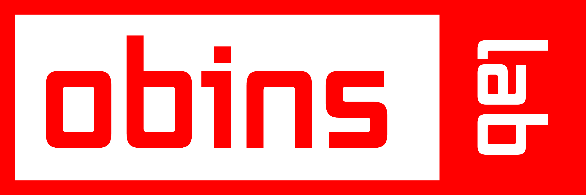

  

# Obinslab Starter Übersetzungen

[English](./README.md) | [简体中文](./README-zh_CN.md) | [Español](./README-es.md) | Deutsch | [Русский](./README-ru.md) | [Français](./README-fr.md) | [ไทย](./README-th.md)

Übersetzungsprojekt für den [Obinslab Starter](http://en.obins.net/obinslab-starter).

Mit dem Obinslab Starter kann die Tastaturbelegung, Lichteffekte und Makros für deine ANNE PRO 2 angepasst werden.

Folge  auf Twitter für wichtige Ankündigungen.

## Wie man eine Übersetzung erstellt

Überprüfe ob für deine Sprache eine Übersetzungsdatei im Ordner `locales` existiert. Wenn die Datei schon existiert, kannst du sie direkt bearbeiten. Wenn die Datei noch nicht existiert, kopiere die Datei `en.yml` und speichere sie als `language-code.yml`. (`language-code` ist der ISO Code der jeweiligen Sprache, siehe unten.)

Beispiel: Wenn du die Sprache `Japanisch` ändern oder erstellen willst, bearbeite oder erstelle die Datei `ja.yml`.

Obinslab Starter nutzt Chromiums `l10n_util` Bibliothek, um die Übersetzungen zu holen.

Die verfügbaren `language-code`'s sind:

| `language-code` | Sprache |
|---------------|---------------|
| af | Afrikaans |
| am | Amharic |
| ar | Arabic |
| az | Azerbaijani |
| be | Belarusian |
| bg | Bulgarian |
| bh | Bihari |
| bn | Bengali |
| br | Breton |
| bs | Bosnian |
| ca | Catalan |
| co | Corsican |
| cs | Czech |
| cy | Welsh |
| da | Danish |
| de | German |
| de-AT | German (Austria) |
| de-CH | German (Switzerland) |
| de-DE | German (Germany) |
| el | Greek |
| en | English |
| en-AU | English (Australia) |
| en-CA | English (Canada) |
| en-GB | English (UK) |
| en-NZ | English (New Zealand) |
| en-US | English (US) |
| en-ZA | English (South Africa) |
| eo | Esperanto |
| es | Spanish |
| es-419 | Spanish (Latin America) |
| et | Estonian |
| eu | Basque |
| fa | Persian |
| fi | Finnish |
| fil | Filipino |
| fo | Faroese |
| fr | French |
| fr-CA | French (Canada) |
| fr-CH | French (Switzerland) |
| fr-FR | French (France) |
| fy | Frisian |
| ga | Irish |
| gd | Scots Gaelic |
| gl | Galician |
| gn | Guarani |
| gu | Gujarati |
| ha | Hausa |
| haw | Hawaiian |
| he | Hebrew |
| hi | Hindi |
| hr | Croatian |
| hu | Hungarian |
| hy | Armenian |
| ia | Interlingua |
| id | Indonesian |
| is | Icelandic |
| it | Italian |
| it-CH | Italian (Switzerland) |
| it-IT | Italian (Italy) |
| ja | Japanese |
| jw | Javanese |
| ka | Georgian |
| kk | Kazakh |
| km | Cambodian |
| kn | Kannada |
| ko | Korean |
| ku | Kurdish |
| ky | Kyrgyz |
| la | Latin |
| ln | Lingala |
| lo | Laothian |
| lt | Lithuanian |
| lv | Latvian |
| mk | Macedonian |
| ml | Malayalam |
| mn | Mongolian |
| mo | Moldavian |
| mr | Marathi |
| ms | Malay |
| mt | Maltese |
| nb | Norwegian (Bokmal) |
| ne | Nepali |
| nl | Dutch |
| nn | Norwegian (Nynorsk) |
| no | Norwegian |
| oc | Occitan |
| om | Oromo |
| or | Oriya |
| pa | Punjabi |
| pl | Polish |
| ps | Pashto |
| pt | Portuguese |
| pt-BR | Portuguese (Brazil) |
| pt-PT | Portuguese (Portugal) |
| qu | Quechua |
| rm | Romansh |
| ro | Romanian |
| ru | Russian |
| sd | Sindhi |
| sh | Serbo-Croatian |
| si | Sinhalese |
| sk | Slovak |
| sl | Slovenian |
| sn | Shona |
| so | Somali |
| sq | Albanian |
| sr | Serbian |
| st | Sesotho |
| su | Sundanese |
| sv | Swedish |
| sw | Swahili |
| ta | Tamil |
| te | Telugu |
| tg | Tajik |
| th | Thai |
| ti | Tigrinya |
| tk | Turkmen |
| to | Tonga |
| tr | Turkish |
| tt | Tatar |
| tw | Twi |
| ug | Uighur |
| uk | Ukrainian |
| ur | Urdu |
| uz | Uzbek |
| vi | Vietnamese |
| xh | Xhosa |
| yi | Yiddish |
| yo | Yoruba |
| zh | Chinese |
| zh-CN | Chinese (Simplified) |
| zh-TW | Chinese (Traditional) |
| zu | Zulu |

## Vorschau deiner Übersetzung in der Anwendung anzeigen

1. Schiebe die `language-code.yml` Datei in den Ordner `locales`. Bearbeite darin die Datei `locales.json` und füge `id` und `name` der Sprache hinzu.

    Den Ordner `locales` findest du unter:
    - Windows
    `C:\Program Files\Obinslab Starter\resources\locales`

    - macOS
    `/Applications/Obinslab Starter.app/Contents/Resources/locales`

2. Starte den Obinslab Starter, gehe in die Einstellungen (Zahnrad -> Prefences) und wähle die neue Sprache aus.

## Wie du mitwirken kannst

Fork -> Bearbeiten -> Pull Request öffnen
